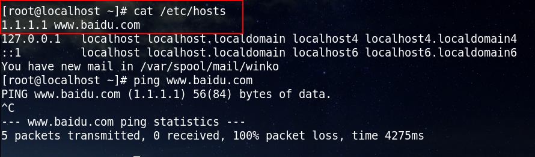
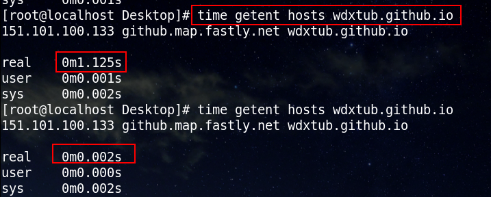
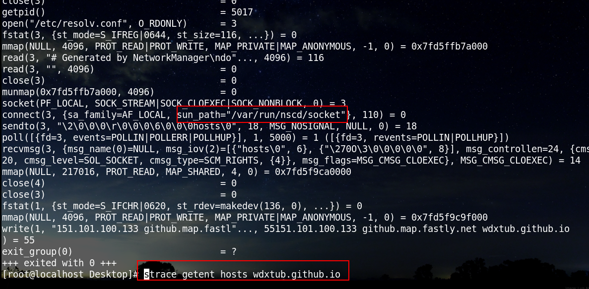
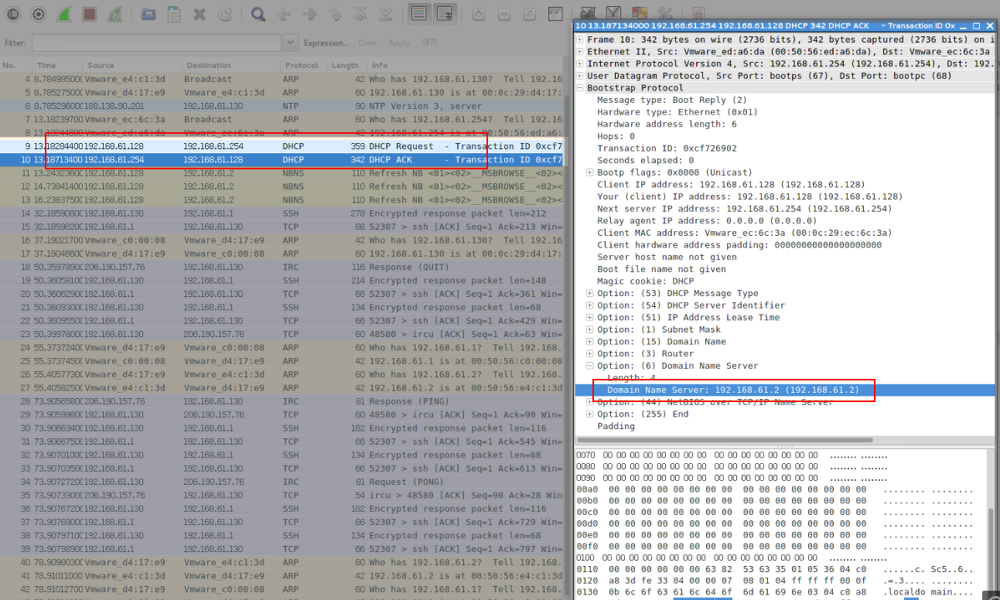
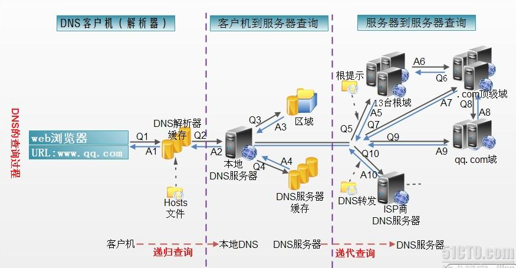

## DNS域名系统
　　DNS(Domain Name System，域名系统)，提供域名到IP的解析功能，可以采用**静态域名解析**方法，若解析不成功，再采用**动态域名解析**方法。使用静态域名解析表的方法，可以大大提高域名解析效率。
<!--more -->

### 静态域名查询

* 本机配置域名到ip的解析于/etc/hosts中，以 *ip domain* 的形式；
  
* 通过查找本地的[nscd](http://www.10tiao.com/html/357/201607/2247484055/1.html)进程中缓存的: getent hosts baiweiguo.github.io。
  
  
* 静态配置dns服务器，配置于: /etc/resolv.conf中，形式为：*nameserver ip*。其中，ip为dns服务器ip；
  
### 动态域名查询
　　如果静态域名查询方式未查询到数据，客户端则会广播本机局域网，若局域网有[DHCP](http://baike.baidu.com/link?url=VFFbr-wynK1El3cj3OOjc77_I9kUXYbFkbxNClcF_SE8PR3eNA8DeXnwfgpbDu2hJu7AzUXIh_bRGJ8miM72C_)(动态主机配置协议)服务器时，才会响应给客户端dns ip：
  
  若[本地DNS服务器](https://www.zhihu.com/question/48085305/answer/109256904)未解析成功，则会向dns服务器进行查询：
  

## DNS查询方式
　　分为递归查询与迭代查询[点此参见](http://blog.csdn.net/shanamaid/article/details/51758820)，[区别](https://zhidao.baidu.com/question/311381817.html)。

## 浏览器域名解析
