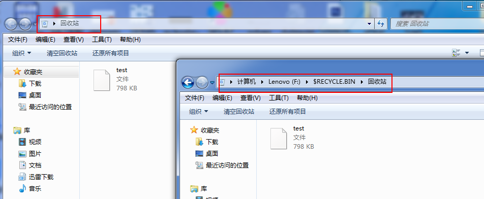

 　　单例模式，保证一个类只有一个实例，是设计模式中最简单的形式之一。例如windows回收站，在各个文件夹目录下，均有个回收站，与桌面上回收站是同一个实例：


<!-- more -->

* 构造函数私有化，只能在本类中定义对象
* 类共享一个实例化对象

```java
class Singleton{
  private Singleton()   // 构造函数私有话，不能使用new进行对象实例化
  {
  }
  private static Singleton instance = new Singleton();
  public static Singleton getInstance()
  {
      return instance;
  }
}
```

单例模式有两种：
* 饿汉式：如上述代码，类中始终为用户提供一个本类的实例化对象；
* 懒汉式：类中不准备好实例化对象，在对象使用之前进行实例化：
```java
class Singleton{
  private Singleton()   // 构造函数私有话，不能使用new进行对象实例化
  {
  }
  private static Singleton instance;
  public static Singleton getInstance()
  {
      if( instance == null )
      {
         instance = new Singleton();
      }
      return instance;
  }
}
```
一般使用饿汉式即可。
