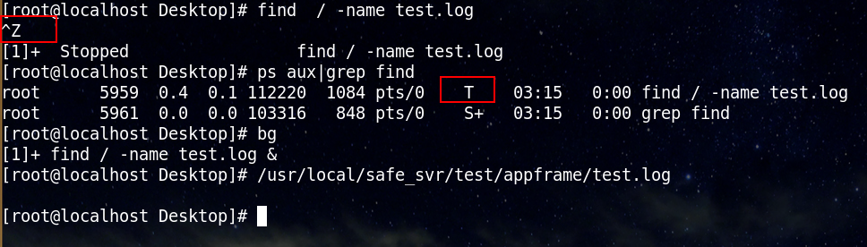

　　[yara](https://github.com/VirusTotal/yara) 是一款开源匹配工具，使用其独特的规则语法用于信息匹配，yara规则可以用于文件及进程信息匹配。
　　其中，扫描进程api：
　　YR_API int **yr_rules_scan_proc**(YR_RULES* rules, int pid, int flags, YR_CALLBACK_FUNC callback, void* user_data, int timeout);
<!-- more -->

　　该接口中使用 ptrace 追踪子进程内存数据，通过使用ptrace(PTRACE_ATTACH, pid, NULL, 0),读取[/proc/pid/mem](http://www.tuicool.com/articles/nUZRBrn)以获取进程数据，ptrace默认会发送[SIGSTOP](http://www.man7.org/linux/man-pages/man2/ptrace.2.html)信号给tracee进程，使该进程处于暂停的僵死状态，（类似ctrl + z 命令，通过命令bg使其后台继续运行，fg使其转入前台运行）,读完数据之后调用ptrace(PTRACE_DETACH, pid,  NULL, 0)使得被扫描进程继续执行。

注意：
* 如果扫描非自身进程内存内容，必须使用ptrace才行，类似：
```C++
sprintf( buf, "/proc/%d/mem" , pid );
fd = open( buf, O_RDONLY );
ptrace( PTRACE_ATTACH, pid, NULL, NULL );
waitpid( pid, NULL, 0 );
lseek( fd, offset, SEEK_SET );
read( fd, buf, sizeof(buf) );
ptrace( PTRACE_DETACH, pid, NULL, NULL);
```

* 如果使用该接口扫描进程数据，发送SIGSTOP之后立即退出而不使用PTRACE_DETACH，则会导致被扫描进程处于僵死状态。类似find 命令执行操作时，使用ctrl + z，使用bg使得命令恢复:



yr_rules_scan_proc接口实现如下：
```C++
YR_API int yr_rules_scan_proc(
    YR_RULES* rules,
    int pid,
    int flags,
    YR_CALLBACK_FUNC callback,
    void* user_data,
    int timeout)
{
  YR_MEMORY_BLOCK_ITERATOR iterator;

  int result = yr_process_open_iterator(
      pid,
      &iterator);   // 此处调用_yr_process_attach

  if (result == ERROR_SUCCESS)
  {
    result = yr_rules_scan_mem_blocks(
        rules,
        &iterator,
        flags | SCAN_FLAGS_PROCESS_MEMORY,
        callback,
        user_data,
        timeout);

    yr_process_close_iterator(&iterator);  // 此处调用_yr_process_detach
  }

  return result;
}

int _yr_process_attach(
    int pid,
    YR_PROC_ITERATOR_CTX* context)
{
  char buffer[256];

  context->pid = pid;
  context->maps = NULL;
  context->mem_fd = -1;

  snprintf(buffer, sizeof(buffer), "/proc/%u/maps", pid);
  context->maps = fopen(buffer, "r");

  if (context->maps == NULL)
    return ERROR_COULD_NOT_ATTACH_TO_PROCESS;

  snprintf(buffer, sizeof(buffer), "/proc/%u/mem", pid);
  context->mem_fd = open(buffer, O_RDONLY);

  if (context->mem_fd == -1)
  {
    fclose(context->maps);
    context->maps = NULL;

    return ERROR_COULD_NOT_ATTACH_TO_PROCESS;
  }

  if (ptrace(PTRACE_ATTACH, pid, NULL, 0) == -1)
  {
    fclose(context->maps);
    context->maps = NULL;

    close(context->mem_fd);
    context->mem_fd = -1;

    return ERROR_COULD_NOT_ATTACH_TO_PROCESS;
  }

  return ERROR_SUCCESS;
}

int _yr_process_detach(
    YR_PROC_ITERATOR_CTX* context)
{
  fclose(context->maps);
  close(context->mem_fd);
  ptrace(PTRACE_DETACH, context->pid, NULL, 0);

  return ERROR_SUCCESS;
}

```
